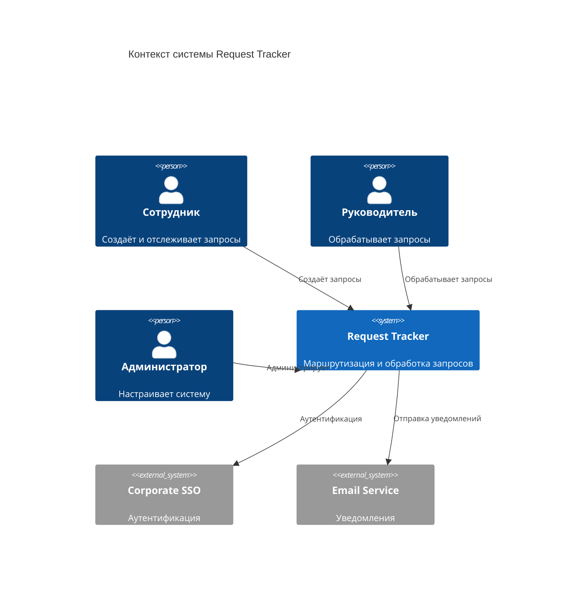

# 01 — Обзор системы

## Назначение

Request Tracker — корпоративная система для подачи, маршрутизации и обработки запросов внутри организации. Сотрудники (подопечные) и руководители создают запросы, которые автоматически или вручную направляются выше по иерархии — руководителям, директорам и другим ответственным лицам в зависимости от типа запроса, роли и настроенных правил.

## Цели

- Единая точка подачи запросов вместо разрозненных каналов (почта, мессенджеры).
- Прозрачный маршрут: автор и участники видят, где находится запрос и кто его обрабатывает.
- Гибкая маршрутизация по ролям, подразделениям, типу запроса и пользовательским правилам.
- Контроль SLA: сроки, эскалация при просрочке.
- Полный аудит действий для отчётности и разбора инцидентов.

## Пользователи и роли

| Роль | Описание |
|------|----------|
| **Сотрудник (Employee)** | Создаёт запросы, отслеживает статус, отвечает на уточнения |
| **Руководитель (Manager)** | Обрабатывает запросы подчинённых, может эскалировать выше |
| **Директор (Director)** | Обрабатывает эскалированные и стратегические запросы |
| **Администратор (Admin)** | Управляет пользователями, маршрутами, типами запросов |
| **Наблюдатель (Observer)** | Только просмотр (аудит, HR, compliance) |

Роли не взаимоисключающие: директор может одновременно быть руководителем подразделения.

## Основные сценарии

### UC-01: Создание запроса

1. Сотрудник выбирает **тип запроса** (отпуск, закупка, согласование документа и т.д.).
2. Заполняет форму (поля зависят от типа).
3. Система **автоматически определяет маршрут** на основе правил.
4. Сотрудник видит предпросмотр маршрута и подтверждает отправку.
5. Запрос попадает первому получателю в цепочке.

### UC-02: Обработка запроса руководителем

1. Руководитель видит входящие запросы в своей очереди.
2. Открывает карточку, изучает детали и вложения.
3. Принимает решение: **одобрить**, **отклонить**, **запросить уточнение**, **эскалировать**.
4. При одобрении запрос переходит следующему участнику маршрута или завершается.
5. Автор получает уведомление о решении.

### UC-03: Эскалация по SLA

1. Запрос находится у получателя дольше установленного SLA.
2. Система автоматически эскалирует запрос выше (следующий уровень иерархии или резервный получатель).
3. В истории фиксируется причина: «Автоэскалация по SLA».

### UC-04: Настройка маршрута (Admin)

1. Администратор создаёт **шаблон маршрута** для типа запроса.
2. Задаёт шаги: роль / конкретный пользователь / подразделение.
3. Настраивает условия: «если сумма > 100 000 → добавить шаг Director».
4. Публикует шаблон; новые запросы используют актуальную версию.

### UC-05: Ручной выбор маршрута

1. При создании запроса автор может выбрать из **допустимых маршрутов** (whitelist).
2. Система валидирует, что выбранный маршрут разрешён для данного типа и роли автора.
3. Маршрут фиксируется и не меняется задним числом (только через формальную процедуру переназначения).

## Глоссарий

| Термин | Определение |
|--------|-------------|
| **Request (Запрос)** | Единица работы: заявка с типом, полями, статусом и маршрутом |
| **Request Type (Тип запроса)** | Шаблон: набор полей, правил маршрутизации, SLA |
| **Route (Маршрут)** | Упорядоченная цепочка шагов обработки |
| **Route Step (Шаг маршрута)** | Один этап: кому назначен, какие действия доступны |
| **Assignment (Назначение)** | Конкретное назначение запроса пользователю на текущем шаге |
| **Transition (Переход)** | Смена статуса / шага с фиксацией в истории |
| **Escalation (Эскалация)** | Передача запроса выше без одобрения текущего получателя |
| **SLA** | Максимальное время обработки на шаге |
| **Org Unit (Подразделение)** | Узел организационной структуры |
| **Audit Log (Журнал аудита)** | Неизменяемая запись всех значимых действий |

## Нефункциональные требования

| Категория | Требование |
|-----------|------------|
| Доступность | 99.5% uptime (рабочие часы) |
| Производительность | Список запросов < 300 ms при 10 000 записей |
| Безопасность | RBAC, аудит, шифрование данных в transit/at rest |
| Масштабируемость | Горизонтальное масштабирование API, read-replicas для отчётов |
| Локализация | RU (основной), EN (опционально) |

## Границы системы (Scope v1)

**В scope:**

- CRUD запросов и типов запросов
- Движок маршрутизации с правилами
- Очереди входящих / исходящих запросов
- Уведомления (in-app + email)
- Аудит и история переходов
- Управление пользователями и оргструктурой

**Вне scope v1:**

- Интеграция с 1С / ERP
- Мобильное приложение
- Электронная подпись
- BI-дашборды (только базовые отчёты)

## Диаграмма контекста

## Связанные документы

- [Доменная модель](02-domain-model.md)
- [Архитектура](03-architecture.md)
- [Движок маршрутизации](04-routing-engine.md)
