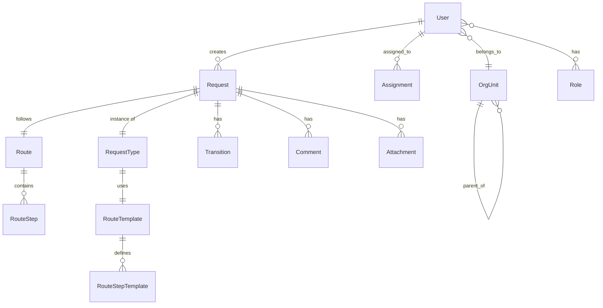
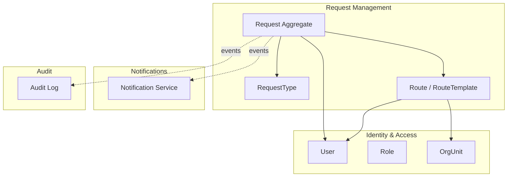
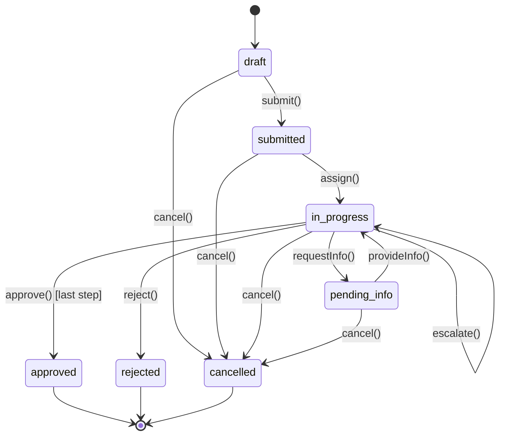

# 02 — Доменная модель

## Подход

Используем **DDD-lite**: выделяем агрегаты с чёткими границами, доменные события для side-effects (уведомления, аудит), value objects для типобезопасности. Без избыточной абстракции — только то, что нужно для чистой архитектуры.

## Диаграмма сущностей



## Агрегаты

### 1. Request (корневой агрегат)

Центральная сущность системы. Все операции над запросом проходят через него.

```typescript
// packages/shared/src/domain/request.ts

type RequestId = string & { readonly brand: unique symbol };
type RequestStatus = 'draft' | 'submitted' | 'in_progress' | 'pending_info' | 'approved' | 'rejected' | 'cancelled';

interface Request {
  id: RequestId;
  typeId: RequestTypeId;
  authorId: UserId;
  title: string;
  fields: Record<string, FieldValue>;   // динамические поля по типу
  status: RequestStatus;
  route: Route;                          // снимок маршрута на момент создания
  currentStepIndex: number;
  priority: 'low' | 'normal' | 'high' | 'urgent';
  createdAt: Date;
  updatedAt: Date;
  submittedAt: Date | null;
  completedAt: Date | null;
}
```

**Инварианты:**

- Нельзя редактировать поля после `submitted`, кроме статуса `pending_info`.
- `currentStepIndex` всегда указывает на активный или завершённый шаг.
- Переход статуса только через доменные методы (`approve`, `reject`, `escalate`).
- Маршрут (`route`) — immutable snapshot; изменение маршрута = отдельная операция `reassign`.

**Доменные методы:**

| Метод | Описание |
|-------|----------|
| `submit()` | Черновик → submitted, создаёт первое Assignment |
| `approve(actorId, comment?)` | Одобрение текущего шага, переход дальше или завершение |
| `reject(actorId, reason)` | Отклонение, статус → rejected |
| `requestInfo(actorId, message)` | Запрос уточнения автору |
| `provideInfo(authorId, fields)` | Автор отвечает, возврат в in_progress |
| `escalate(actorId \| 'system', reason)` | Передача выше |
| `cancel(actorId)` | Отмена (только автор или admin) |
| `reassign(adminId, newAssigneeId, reason)` | Админ переназначает текущий шаг |

**Доменные события:**

```
RequestSubmitted
RequestApproved
RequestRejected
RequestEscalated
RequestCompleted
RequestCancelled
InfoRequested
InfoProvided
StepReassigned
```

### 2. Route (value object + aggregate helper)

```typescript
interface Route {
  id: RouteId;
  templateId: RouteTemplateId;
  templateVersion: number;
  steps: RouteStep[];
}

interface RouteStep {
  index: number;
  name: string;
  assigneeType: 'user' | 'role' | 'org_unit_head' | 'dynamic';
  assigneeRef: string;          // userId, roleId, orgUnitId или expression
  actions: StepAction[];        // approve | reject | escalate | request_info
  slaHours: number | null;
  status: 'pending' | 'active' | 'completed' | 'skipped';
  completedAt: Date | null;
  completedBy: UserId | null;
  resolution: 'approved' | 'rejected' | 'escalated' | 'skipped' | null;
}

type StepAction = 'approve' | 'reject' | 'escalate' | 'request_info';
```

**Инварианты:**

- Шаги упорядочены по `index`, без пропусков.
- Только один шаг может быть `active`.
- `completed` шаги неизменяемы.

### 3. RouteTemplate (агрегат конфигурации)

```typescript
interface RouteTemplate {
  id: RouteTemplateId;
  name: string;
  version: number;
  isPublished: boolean;
  steps: RouteStepTemplate[];
  conditions: RoutingCondition[];   // условные ветвления
}

interface RouteStepTemplate {
  order: number;
  name: string;
  assigneeType: AssigneeType;
  assigneeRef: string;
  actions: StepAction[];
  slaHours: number | null;
}

interface RoutingCondition {
  field: string;                   // поле запроса или метаданные
  operator: 'eq' | 'gt' | 'lt' | 'in' | 'contains';
  value: unknown;
  action: 'add_step' | 'skip_step' | 'change_assignee';
  target: string;
}
```

### 4. RequestType (агрегат конфигурации)

```typescript
interface RequestType {
  id: RequestTypeId;
  code: string;                    // 'vacation', 'purchase', ...
  name: string;
  description: string;
  fieldSchema: FieldSchema[];      // JSON Schema-like
  routeTemplateId: RouteTemplateId;
  allowedManualRoutes: RouteTemplateId[];  // whitelist для ручного выбора
  isActive: boolean;
}

interface FieldSchema {
  key: string;
  label: string;
  type: 'text' | 'number' | 'date' | 'select' | 'file' | 'user_ref';
  required: boolean;
  options?: { value: string; label: string }[];
  validation?: Record<string, unknown>;
}
```

### 5. User (агрегат идентичности)

```typescript
interface User {
  id: UserId;
  email: string;
  fullName: string;
  orgUnitId: OrgUnitId;
  roles: RoleId[];
  managerId: UserId | null;        // прямой руководитель
  isActive: boolean;
}
```

### 6. OrgUnit (справочник)

```typescript
interface OrgUnit {
  id: OrgUnitId;
  name: string;
  parentId: OrgUnitId | null;
  headId: UserId | null;           // руководитель подразделения
  path: string;                    // materialized path: '/1/5/12/'
}
```

### 7. Assignment (сущность внутри Request)

```typescript
interface Assignment {
  id: AssignmentId;
  requestId: RequestId;
  stepIndex: number;
  assigneeId: UserId;
  status: 'pending' | 'accepted' | 'completed';
  assignedAt: Date;
  dueAt: Date | null;              // SLA deadline
  completedAt: Date | null;
}
```

### 8. Transition (запись истории)

```typescript
interface Transition {
  id: TransitionId;
  requestId: RequestId;
  fromStatus: RequestStatus;
  toStatus: RequestStatus;
  fromStep: number | null;
  toStep: number | null;
  actorId: UserId | 'system';
  action: string;
  comment: string | null;
  metadata: Record<string, unknown>;
  createdAt: Date;
}
```

### 9. Comment, Attachment

```typescript
interface Comment {
  id: CommentId;
  requestId: RequestId;
  authorId: UserId;
  body: string;
  isInternal: boolean;             // виден только обработчикам
  createdAt: Date;
}

interface Attachment {
  id: AttachmentId;
  requestId: RequestId;
  uploadedBy: UserId;
  fileName: string;
  mimeType: string;
  sizeBytes: number;
  storageKey: string;
  createdAt: Date;
}
```

## Bounded Contexts



| Context | Ответственность | Зависимости |
|---------|-----------------|-------------|
| **Request Management** | Жизненный цикл запросов, маршрутизация | Identity (только ID) |
| **Identity & Access** | Пользователи, роли, оргструктура | — |
| **Notifications** | Доставка уведомлений | Request events |
| **Audit** | Неизменяемый журнал | Все events |

Между контекстами — только через ID и domain events, без прямых JOIN-ов чужих таблиц в доменной логике.

## State Machine запроса



## Резолвер получателей (Assignee Resolver)

Доменный сервис, не привязанный к конкретному агрегату:

```typescript
interface AssigneeResolver {
  resolve(step: RouteStepTemplate, context: ResolutionContext): Promise<UserId[]>;
}

interface ResolutionContext {
  author: User;
  requestFields: Record<string, FieldValue>;
  orgUnit: OrgUnit;
}
```

| assigneeType | Логика |
|--------------|--------|
| `user` | Конкретный пользователь по ID |
| `role` | Все активные пользователи с ролью в подразделении автора |
| `org_unit_head` | `headId` подразделения автора |
| `dynamic` | Выражение: `author.manager`, `orgUnit.head`, `field:approver_id` |

## Связанные документы

- [Архитектура](03-architecture.md)
- [Движок маршрутизации](04-routing-engine.md)
- [Схема БД](06-database-schema.md)
