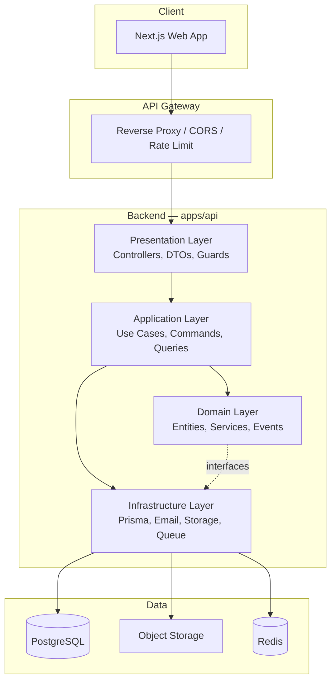
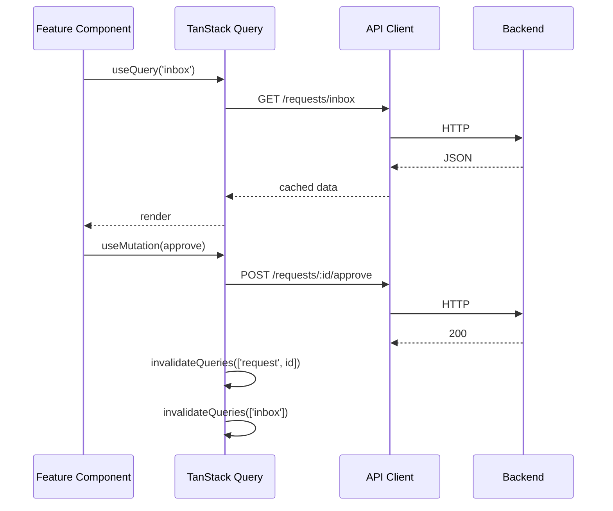
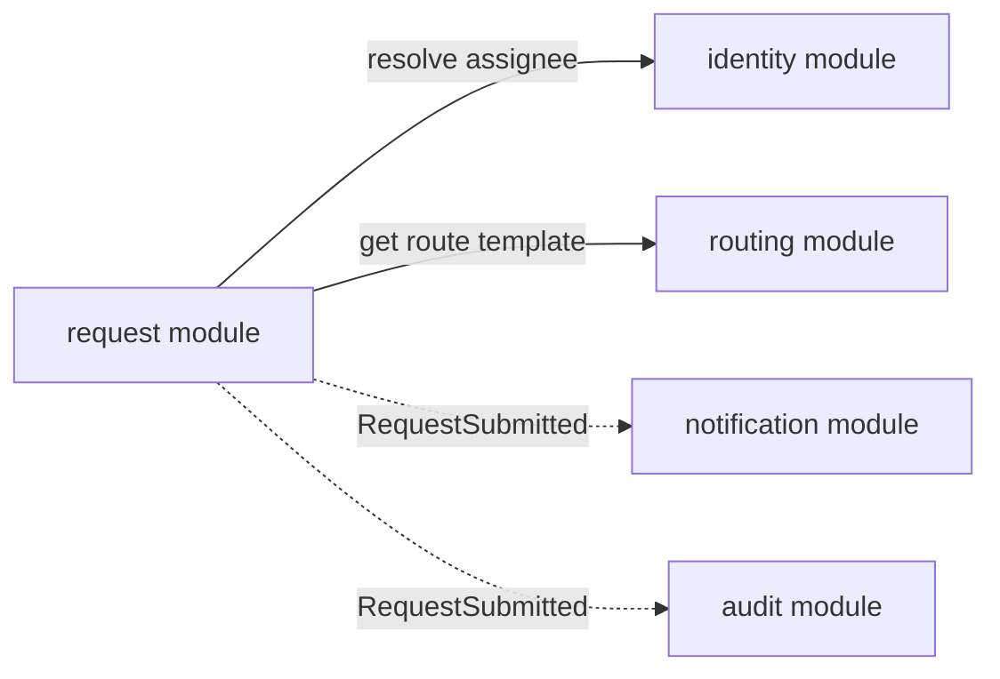

# 03 — Архитектура

## Общая схема



## Принципы

### Clean Architecture (Backend)

Зависимости направлены **внутрь**: Domain не знает ни о NestJS, ни о Prisma.

```
Presentation  →  Application  →  Domain  ←  Infrastructure
(Controllers)    (Use Cases)     (Entities)   (Repositories)
```

| Слой | Ответственность | Запрещено |
|------|-----------------|-----------|
| **Domain** | Бизнес-правила, инварианты, события | Импорт фреймворков, ORM, HTTP |
| **Application** | Оркестрация use cases, транзакции | SQL, HTTP-ответы |
| **Infrastructure** | БД, email, файлы, очереди | Бизнес-логика |
| **Presentation** | HTTP, валидация входа, auth guards | Бизнес-логика |

### Feature-Sliced Design (Frontend)

```
apps/web/src/
├── app/              # Next.js App Router (pages, layouts)
├── processes/        # Сквозные процессы (auth flow)
├── pages/            # Композиция виджетов (deprecated в FSD v2 → app/)
├── widgets/          # Крупные UI-блоки (RequestCard, RouteTimeline)
├── features/         # Действия пользователя (ApproveRequest, CreateRequest)
├── entities/         # Бизнес-сущности (request, user, route)
└── shared/           # UI-kit, API client, utils
```

**Правило импортов:** слой может импортировать только из слоёв ниже.

```
app → widgets → features → entities → shared
```

## Backend: структура модулей

```
apps/api/src/
├── main.ts
├── app.module.ts
│
├── modules/
│   ├── request/                    # Bounded Context: Request Management
│   │   ├── domain/
│   │   │   ├── request.entity.ts
│   │   │   ├── route.vo.ts
│   │   │   ├── request.repository.ts      # interface
│   │   │   ├── assignee-resolver.service.ts
│   │   │   └── events/
│   │   ├── application/
│   │   │   ├── commands/
│   │   │   │   ├── create-request.handler.ts
│   │   │   │   ├── submit-request.handler.ts
│   │   │   │   ├── approve-request.handler.ts
│   │   │   │   └── ...
│   │   │   ├── queries/
│   │   │   │   ├── get-request.handler.ts
│   │   │   │   ├── list-inbox.handler.ts
│   │   │   │   └── ...
│   │   │   └── services/
│   │   │       └── routing.service.ts
│   │   ├── infrastructure/
│   │   │   ├── request.repository.impl.ts   # Prisma
│   │   │   └── request.mapper.ts
│   │   └── presentation/
│   │       ├── request.controller.ts
│   │       └── dto/
│   │
│   ├── routing/                    # RouteTemplate, RequestType config
│   ├── identity/                   # User, Role, OrgUnit
│   ├── notification/
│   └── audit/
│
├── shared/
│   ├── domain/                     # Base entity, ValueObject, DomainEvent
│   ├── infrastructure/
│   │   ├── prisma/
│   │   ├── email/
│   │   └── storage/
│   └── presentation/
│       ├── guards/
│       ├── filters/
│       └── interceptors/
│
└── config/
```

## Паттерны Application Layer

### CQRS (упрощённый)

Команды меняют состояние, запросы — только читают.

```typescript
// Command
interface SubmitRequestCommand {
  requestId: string;
  actorId: string;
}

// Handler
class SubmitRequestHandler {
  constructor(
    private repo: RequestRepository,
    private routing: RoutingService,
    private eventBus: EventBus,
  ) {}

  async execute(cmd: SubmitRequestCommand): Promise<void> {
    const request = await this.repo.findById(cmd.requestId);
    request.submit();                                    // domain logic
    const assignee = await this.routing.resolveFirstStep(request);
    request.assignCurrentStep(assignee);
    await this.repo.save(request);
    await this.eventBus.publishAll(request.pullEvents());
  }
}
```

### Repository Pattern

```typescript
// domain/request.repository.ts
interface RequestRepository {
  findById(id: RequestId): Promise<Request | null>;
  save(request: Request): Promise<void>;
  findInbox(userId: UserId, filters: InboxFilters): Promise<Request[]>;
}

// infrastructure/request.repository.impl.ts
class PrismaRequestRepository implements RequestRepository {
  // mapping Domain ↔ Prisma models
}
```

### Domain Events + Handlers

```typescript
// Side effects вынесены из агрегата
@EventHandler(RequestSubmitted)
class NotifyOnSubmit {
  async handle(event: RequestSubmitted) {
    await this.notification.send(event.assigneeId, ...);
    await this.audit.log(event);
  }
}
```

## Frontend: ключевые решения

| Аспект | Решение |
|--------|---------|
| Роутинг | Next.js App Router |
| Серверное состояние | TanStack Query (React Query) |
| Клиентское состояние | Zustand (UI state, filters) |
| Формы | React Hook Form + Zod |
| UI Kit | shadcn/ui + Tailwind CSS |
| Realtime | SSE или WebSocket через TanStack Query invalidation |

### Data Flow



## Межмодульное взаимодействие



- **Синхронные вызовы** — через application services (inject).
- **Асинхронные** — domain events → event handlers.
- Модули **не импортируют** domain друг друга напрямую.

## Shared Package

```
packages/shared/
├── src/
│   ├── types/           # RequestStatus, RoleId, DTO types
│   ├── constants/       # SLA defaults, status labels
│   ├── validation/      # Zod schemas (shared front + back)
│   └── utils/           # date formatting, id generation
├── package.json
└── tsconfig.json
```

Один источник правды для типов и валидации на фронте и бэке.

## Обработка ошибок

### Backend

```typescript
// Domain errors
class RequestNotFoundError extends DomainError {}
class InvalidTransitionError extends DomainError {}
class AccessDeniedError extends DomainError {}

// Global exception filter → HTTP mapping
RequestNotFoundError  → 404
InvalidTransitionError → 409
AccessDeniedError     → 403
ValidationError       → 422
```

### Frontend

```typescript
// shared/api/client.ts
const api = axios.create({ baseURL: '/api' });
api.interceptors.response.use(null, (error) => {
  const code = error.response?.data?.code;
  // toast, redirect, etc.
});
```

## Безопасность

| Уровень | Механизм |
|---------|----------|
| Transport | HTTPS, HSTS |
| Auth | JWT access (15 min) + refresh (7 d) |
| Authorization | RBAC guards + policy checks в use cases |
| Input | Zod/class-validator на входе |
| Output | DTO — никогда не отдаём внутренние поля |
| Files | Presigned URLs, MIME validation, size limits |
| Rate limit | 100 req/min per user |

## Observability

- **Structured logging** (pino): requestId, userId, action.
- **Health checks**: `/health`, `/ready`.
- **Metrics** (будущее): Prometheus — latency, queue depth, SLA breaches.

## Связанные документы

- [Доменная модель](02-domain-model.md)
- [API](05-api-specification.md)
- [Фронтенд](07-frontend-architecture.md)
- [Гайд по разработке](09-development-guide.md)
