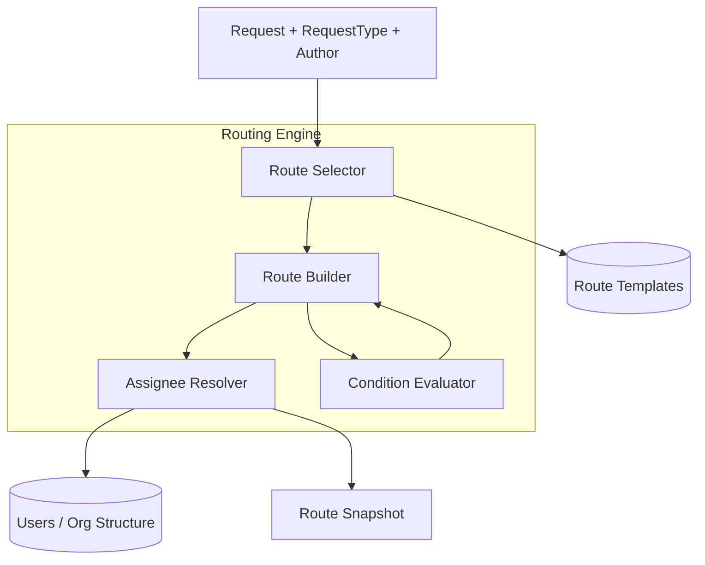
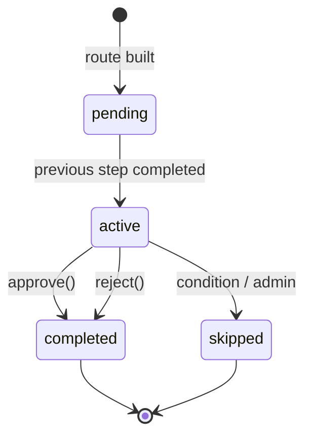
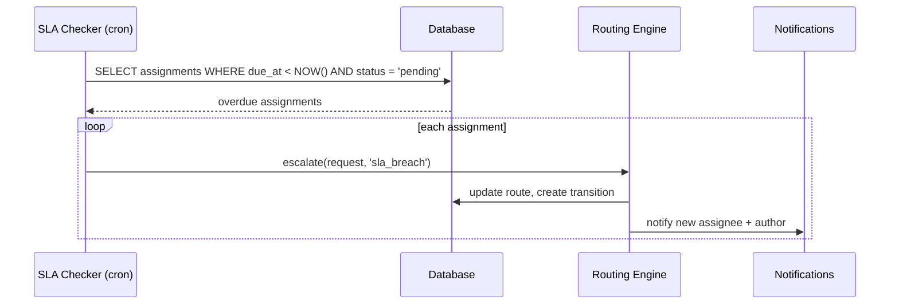

# 04 — Движок маршрутизации

## Назначение

Routing Engine — доменный сервис, который определяет **кому** и **в каком порядке** будет направлен запрос. Работает в двух режимах:

1. **Автоматический** — маршрут строится по шаблону и правилам типа запроса.
2. **Ручной** — автор выбирает из whitelist допустимых маршрутов.

## Архитектура движка



## Алгоритм построения маршрута

```
1. Получить RequestType → default RouteTemplate
2. Если автор указал manualRouteId:
     a. Проверить, что routeId ∈ RequestType.allowedManualRoutes
     b. Проверить, что автор имеет право на этот маршрут (RBAC)
     c. Использовать выбранный шаблон
3. Скопировать шаги из RouteTemplate
4. Применить RoutingConditions:
     a. Для каждого condition проверить поле запроса
     b. add_step → вставить шаг
     c. skip_step → пометить шаг как skipped
     d. change_assignee → изменить assigneeRef
5. Для каждого шага вызвать AssigneeResolver → конкретный UserId
6. Сохранить Route как immutable snapshot в Request
```

## Типы назначения (AssigneeType)

| Тип | assigneeRef | Пример | Результат |
|-----|-------------|--------|-----------|
| `user` | UUID пользователя | `"usr_abc123"` | Конкретный человек |
| `role` | ID роли | `"role_manager"` | Пользователи с ролью в orgUnit автора |
| `org_unit_head` | ID подразделения | `"org_sales"` | headId подразделения |
| `manager_chain` | Уровень (1, 2, 3) | `"1"` | author.manager (1), manager.manager (2) |
| `dynamic` | Expression | `"field:budget_owner"` | Значение поля запроса |
| `pool` | ID пула | `"pool_hr"` | Round-robin из группы |

### Assignee Resolver — псевдокод

```typescript
async resolve(
  step: RouteStepTemplate,
  ctx: ResolutionContext,
): Promise<UserId> {
  switch (step.assigneeType) {
    case 'user':
      return this.ensureActive(step.assigneeRef);

    case 'role':
      const users = await this.userRepo.findByRoleAndOrgUnit(
        step.assigneeRef,
        ctx.author.orgUnitId,
      );
      return this.selectByLoadBalance(users);

    case 'org_unit_head':
      const org = await this.orgRepo.findById(ctx.author.orgUnitId);
      return this.ensureActive(org.headId);

    case 'manager_chain':
      return this.walkManagerChain(ctx.author, parseInt(step.assigneeRef));

    case 'dynamic':
      const fieldKey = step.assigneeRef.replace('field:', '');
      return this.ensureActive(ctx.requestFields[fieldKey] as string);

    case 'pool':
      return this.poolService.nextAssignee(step.assigneeRef);

    default:
      throw new UnknownAssigneeTypeError(step.assigneeType);
  }
}
```

## Условная маршрутизация

### RoutingCondition

```typescript
interface RoutingCondition {
  id: string;
  priority: number;               // порядок применения
  when: ConditionExpression;
  then: ConditionAction;
}

interface ConditionExpression {
  field: string;                    // 'fields.amount', 'author.orgUnitId', 'priority'
  operator: 'eq' | 'neq' | 'gt' | 'gte' | 'lt' | 'lte' | 'in' | 'contains';
  value: unknown;
}

interface ConditionAction {
  type: 'add_step' | 'skip_step' | 'change_assignee' | 'set_sla';
  stepTemplate?: RouteStepTemplate;
  stepIndex?: number;
  newAssigneeRef?: string;
  slaHours?: number;
}
```

### Примеры правил

**Закупка: сумма > 100 000 → добавить директора**

```json
{
  "when": { "field": "fields.amount", "operator": "gt", "value": 100000 },
  "then": {
    "type": "add_step",
    "stepTemplate": {
      "order": 99,
      "name": "Согласование директора",
      "assigneeType": "role",
      "assigneeRef": "role_director",
      "actions": ["approve", "reject"],
      "slaHours": 48
    }
  }
}
```

**Отпуск > 14 дней → HR**

```json
{
  "when": { "field": "fields.days", "operator": "gt", "value": 14 },
  "then": {
    "type": "add_step",
    "stepTemplate": {
      "order": 2,
      "name": "Согласование HR",
      "assigneeType": "pool",
      "assigneeRef": "pool_hr",
      "actions": ["approve", "reject"],
      "slaHours": 24
    }
  }
}
```

**IT-запрос → пропустить руководителя**

```json
{
  "when": { "field": "fields.category", "operator": "eq", "value": "it_support" },
  "then": { "type": "skip_step", "stepIndex": 0 }
}
```

## Жизненный цикл шага



### Переход на следующий шаг

```typescript
advanceRoute(request: Request): void {
  const current = request.route.steps[request.currentStepIndex];
  current.status = 'completed';
  current.completedAt = new Date();

  const nextIndex = request.route.steps.findIndex(
    (s, i) => i > request.currentStepIndex && s.status === 'pending',
  );

  if (nextIndex === -1) {
    request.status = 'approved';
    request.completedAt = new Date();
    request.raise(new RequestCompleted(...));
    return;
  }

  request.currentStepIndex = nextIndex;
  request.route.steps[nextIndex].status = 'active';
  request.raise(new StepActivated(...));
}
```

## Эскалация

### Типы эскалации

| Тип | Триггер | Действие |
|-----|---------|----------|
| **Manual** | Пользователь нажимает «Эскалировать» | Передача следующему в manager_chain или override |
| **SLA Auto** | Cron: `dueAt < now()` | Автоэскалация + уведомление |
| **Admin** | Админ переназначает | Reassign на конкретного пользователя |

### SLA Auto-Escalation (фоновый процесс)



```typescript
// Запуск каждые 5 минут
async checkSlaBreaches(): Promise<void> {
  const overdue = await this.assignmentRepo.findOverdue();
  for (const assignment of overdue) {
    const request = await this.requestRepo.findById(assignment.requestId);
    request.escalate('system', `SLA breach: step "${assignment.stepName}" overdue`);
    await this.requestRepo.save(request);
    await this.eventBus.publishAll(request.pullEvents());
  }
}
```

## Ручной выбор маршрута

### UI Flow

1. Автор выбирает тип запроса.
2. Frontend запрашивает `GET /request-types/:id/available-routes`.
3. Backend возвращает маршруты из `allowedManualRoutes`, отфильтрованные по RBAC.
4. Автор выбирает маршрут (или оставляет default).
5. При создании запрос передаёт `routeTemplateId` (optional).

### Валидация

```typescript
async validateManualRoute(
  authorId: UserId,
  requestTypeId: RequestTypeId,
  routeTemplateId: RouteTemplateId,
): Promise<void> {
  const type = await this.typeRepo.findById(requestTypeId);

  if (!type.allowedManualRoutes.includes(routeTemplateId)) {
    throw new RouteNotAllowedError();
  }

  const canSelect = await this.policy.can(authorId, 'request:select-route', {
    requestTypeId,
    routeTemplateId,
  });

  if (!canSelect) throw new AccessDeniedError();
}
```

## Персональный маршрут (сборка автором)

Режим для типов с `allowsPersonalRoute = true`. Отличается от UC-05: автор не выбирает готовый шаблон, а **собирает цепочку шагов** из конкретных сотрудников.

### Алгоритм

```
1. Проверить RequestType.allowsPersonalRoute === true
2. Проверить право request:build-personal-route
3. Валидировать personalSteps[]:
     a. 1 ≤ steps.length ≤ maxPersonalRouteSteps
     b. Каждый шаг: assigneeType = 'user', assigneeRef = active UserId
     c. assigneeRef ≠ authorId (нельзя согласовать самому себе)
     d. Без дубликатов assigneeRef подряд
4. Построить Route snapshot из personalSteps (без RouteTemplate)
5. Сохранить в Request.route с templateId = null, source = 'personal'
```

### Структура шага (вход API)

```typescript
interface PersonalRouteStepInput {
  name: string;           // «Согласование руководителя»
  assigneeUserId: UserId;
  slaHours?: number | null;
}
```

### UI Flow (создание запроса)

1. Автор выбирает тип с `allowsPersonalRoute`.
2. На шаге «Маршрут» видит конструктор: «Добавить согласующего» → поиск сотрудника → название шага.
3. По умолчанию предлагается **непосредственный руководитель** автора (из `User.managerId`).
4. Превью цепочки перед отправкой.
5. При submit передаётся `{ personalSteps: [...] }` вместо `routeTemplateId`.

### Ограничения

| Правило | Значение по умолчанию |
|---------|----------------------|
| Макс. шагов | `maxPersonalRouteSteps` (5) |
| Мин. шагов | 1 |
| Тип назначения | только `user` |
| Себя назначить | запрещено |
| Неактивный пользователь | запрещено |

### Связь с кастомными полями

Поле `user_ref` в `fieldSchema` может дополнять персональный маршрут: например, поле «Кому адресовано» для информации, а шаг маршрута — для формального согласования. В v2 допустима привязка `dynamic` assignee к полю `user_ref`.

## Визуализация маршрута (Timeline)

Frontend-компонент `RouteTimeline` отображает:

```
[✓ Шаг 1: Руководитель — Иванов И. — Одобрено 01.07 14:30]
[● Шаг 2: HR — Петрова А. — В работе (осталось 4ч)]
[○ Шаг 3: Директор — (ожидает)]
```

## Версионирование шаблонов

- RouteTemplate имеет `version`. При публикации `version++`.
- Request хранит `templateId + templateVersion` — snapshot.
- Изменение шаблона **не влияет** на уже созданные запросы.
- Admin может посмотреть diff между версиями.

## Тестирование движка

| Тест | Что проверяем |
|------|---------------|
| Unit | ConditionEvaluator: все операторы |
| Unit | AssigneeResolver: каждый assigneeType |
| Unit | RouteBuilder: add/skip/change steps |
| Integration | Полный flow: create → route → assign → approve |
| Integration | SLA escalation cron |

## Связанные документы

- [Доменная модель](02-domain-model.md)
- [API](05-api-specification.md)
- [Роли и права](08-roles-and-permissions.md)
