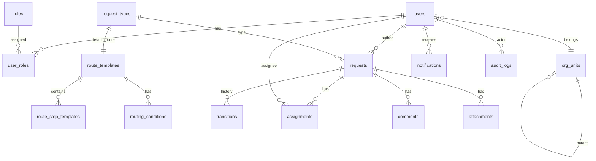

# 06 — Схема базы данных

## СУБД

**PostgreSQL 16+** — основное хранилище. JSONB для динамических полей и snapshot маршрутов.

## ER-диаграмма



## Таблицы

### users

```sql
CREATE TABLE users (
    id          UUID PRIMARY KEY DEFAULT gen_random_uuid(),
    email       VARCHAR(255) NOT NULL UNIQUE,
    password_hash VARCHAR(255),          -- null если SSO
    full_name   VARCHAR(255) NOT NULL,
    org_unit_id UUID NOT NULL REFERENCES org_units(id),
    manager_id  UUID REFERENCES users(id),
    is_active   BOOLEAN NOT NULL DEFAULT true,
    created_at  TIMESTAMPTZ NOT NULL DEFAULT now(),
    updated_at  TIMESTAMPTZ NOT NULL DEFAULT now()
);

CREATE INDEX idx_users_org_unit ON users(org_unit_id);
CREATE INDEX idx_users_manager ON users(manager_id);
CREATE INDEX idx_users_email ON users(email);
```

### roles

```sql
CREATE TABLE roles (
    id          UUID PRIMARY KEY DEFAULT gen_random_uuid(),
    code        VARCHAR(50) NOT NULL UNIQUE,   -- 'employee', 'manager', 'director', 'admin'
    name        VARCHAR(100) NOT NULL,
    description TEXT
);

CREATE TABLE user_roles (
    user_id     UUID NOT NULL REFERENCES users(id) ON DELETE CASCADE,
    role_id     UUID NOT NULL REFERENCES roles(id) ON DELETE CASCADE,
    PRIMARY KEY (user_id, role_id)
);
```

### org_units

```sql
CREATE TABLE org_units (
    id          UUID PRIMARY KEY DEFAULT gen_random_uuid(),
    name        VARCHAR(255) NOT NULL,
    parent_id   UUID REFERENCES org_units(id),
    head_id     UUID REFERENCES users(id),
    path        VARCHAR(1000) NOT NULL,         -- materialized path: '/root/sales/team1/'
    created_at  TIMESTAMPTZ NOT NULL DEFAULT now()
);

CREATE INDEX idx_org_units_parent ON org_units(parent_id);
CREATE INDEX idx_org_units_path ON org_units(path);
```

### route_templates

```sql
CREATE TABLE route_templates (
    id          UUID PRIMARY KEY DEFAULT gen_random_uuid(),
    name        VARCHAR(255) NOT NULL,
    version     INT NOT NULL DEFAULT 1,
    is_published BOOLEAN NOT NULL DEFAULT false,
    created_at  TIMESTAMPTZ NOT NULL DEFAULT now(),
    updated_at  TIMESTAMPTZ NOT NULL DEFAULT now(),

    UNIQUE (id, version)                        -- composite для versioning
);

CREATE TABLE route_step_templates (
    id                  UUID PRIMARY KEY DEFAULT gen_random_uuid(),
    route_template_id   UUID NOT NULL REFERENCES route_templates(id) ON DELETE CASCADE,
    route_template_version INT NOT NULL,
    step_order          INT NOT NULL,
    name                VARCHAR(255) NOT NULL,
    assignee_type       VARCHAR(50) NOT NULL,   -- user, role, org_unit_head, manager_chain, dynamic, pool
    assignee_ref        VARCHAR(255) NOT NULL,
    actions             VARCHAR(50)[] NOT NULL,  -- {approve, reject, escalate, request_info}
    sla_hours           INT,

    FOREIGN KEY (route_template_id, route_template_version)
        REFERENCES route_templates(id, version)
);

CREATE TABLE routing_conditions (
    id                  UUID PRIMARY KEY DEFAULT gen_random_uuid(),
    route_template_id   UUID NOT NULL REFERENCES route_templates(id) ON DELETE CASCADE,
    route_template_version INT NOT NULL,
    priority            INT NOT NULL DEFAULT 0,
    condition_field     VARCHAR(255) NOT NULL,
    condition_operator  VARCHAR(20) NOT NULL,
    condition_value     JSONB NOT NULL,
    action_type         VARCHAR(50) NOT NULL,   -- add_step, skip_step, change_assignee, set_sla
    action_payload      JSONB NOT NULL,

    FOREIGN KEY (route_template_id, route_template_version)
        REFERENCES route_templates(id, version)
);
```

### request_types

```sql
CREATE TABLE request_types (
    id                      UUID PRIMARY KEY DEFAULT gen_random_uuid(),
    code                    VARCHAR(50) NOT NULL UNIQUE,
    name                    VARCHAR(255) NOT NULL,
    description             TEXT,
    field_schema            JSONB NOT NULL,     -- [{key, label, type, required, ...}]
    default_route_template_id UUID REFERENCES route_templates(id),
    allowed_manual_routes   UUID[],             -- whitelist route template IDs
    is_active               BOOLEAN NOT NULL DEFAULT true,
    created_at              TIMESTAMPTZ NOT NULL DEFAULT now(),
    updated_at              TIMESTAMPTZ NOT NULL DEFAULT now()
);
```

### requests

```sql
CREATE TABLE requests (
    id                  UUID PRIMARY KEY DEFAULT gen_random_uuid(),
    type_id             UUID NOT NULL REFERENCES request_types(id),
    author_id           UUID NOT NULL REFERENCES users(id),
    title               VARCHAR(500) NOT NULL,
    fields              JSONB NOT NULL DEFAULT '{}',
    status              VARCHAR(30) NOT NULL DEFAULT 'draft',
    priority            VARCHAR(20) NOT NULL DEFAULT 'normal',
    route_snapshot      JSONB,                  -- immutable Route snapshot
    current_step_index  INT,
    created_at          TIMESTAMPTZ NOT NULL DEFAULT now(),
    updated_at          TIMESTAMPTZ NOT NULL DEFAULT now(),
    submitted_at        TIMESTAMPTZ,
    completed_at        TIMESTAMPTZ,

    CONSTRAINT chk_status CHECK (status IN (
        'draft', 'submitted', 'in_progress', 'pending_info',
        'approved', 'rejected', 'cancelled'
    )),
    CONSTRAINT chk_priority CHECK (priority IN ('low', 'normal', 'high', 'urgent'))
);

CREATE INDEX idx_requests_author ON requests(author_id);
CREATE INDEX idx_requests_status ON requests(status);
CREATE INDEX idx_requests_type ON requests(type_id);
CREATE INDEX idx_requests_created ON requests(created_at DESC);
CREATE INDEX idx_requests_fields ON requests USING GIN (fields);
```

### assignments

```sql
CREATE TABLE assignments (
    id          UUID PRIMARY KEY DEFAULT gen_random_uuid(),
    request_id  UUID NOT NULL REFERENCES requests(id) ON DELETE CASCADE,
    step_index  INT NOT NULL,
    assignee_id UUID NOT NULL REFERENCES users(id),
    status      VARCHAR(20) NOT NULL DEFAULT 'pending',
    assigned_at TIMESTAMPTZ NOT NULL DEFAULT now(),
    due_at      TIMESTAMPTZ,
    completed_at TIMESTAMPTZ,

    CONSTRAINT chk_assignment_status CHECK (status IN ('pending', 'accepted', 'completed'))
);

CREATE INDEX idx_assignments_assignee ON assignments(assignee_id, status);
CREATE INDEX idx_assignments_request ON assignments(request_id);
CREATE INDEX idx_assignments_due ON assignments(due_at) WHERE status = 'pending';
```

### transitions

```sql
CREATE TABLE transitions (
    id          UUID PRIMARY KEY DEFAULT gen_random_uuid(),
    request_id  UUID NOT NULL REFERENCES requests(id) ON DELETE CASCADE,
    from_status VARCHAR(30),
    to_status   VARCHAR(30) NOT NULL,
    from_step   INT,
    to_step     INT,
    actor_id    UUID REFERENCES users(id),      -- null = system
    action      VARCHAR(50) NOT NULL,
    comment     TEXT,
    metadata    JSONB DEFAULT '{}',
    created_at  TIMESTAMPTZ NOT NULL DEFAULT now()
);

CREATE INDEX idx_transitions_request ON transitions(request_id, created_at);
```

### comments

```sql
CREATE TABLE comments (
    id          UUID PRIMARY KEY DEFAULT gen_random_uuid(),
    request_id  UUID NOT NULL REFERENCES requests(id) ON DELETE CASCADE,
    author_id   UUID NOT NULL REFERENCES users(id),
    body        TEXT NOT NULL,
    is_internal BOOLEAN NOT NULL DEFAULT false,
    created_at  TIMESTAMPTZ NOT NULL DEFAULT now()
);

CREATE INDEX idx_comments_request ON comments(request_id, created_at);
```

### attachments

```sql
CREATE TABLE attachments (
    id          UUID PRIMARY KEY DEFAULT gen_random_uuid(),
    request_id  UUID NOT NULL REFERENCES requests(id) ON DELETE CASCADE,
    uploaded_by UUID NOT NULL REFERENCES users(id),
    file_name   VARCHAR(500) NOT NULL,
    mime_type   VARCHAR(100) NOT NULL,
    size_bytes  BIGINT NOT NULL,
    storage_key VARCHAR(500) NOT NULL,
    created_at  TIMESTAMPTZ NOT NULL DEFAULT now()
);

CREATE INDEX idx_attachments_request ON attachments(request_id);
```

### notifications

```sql
CREATE TABLE notifications (
    id          UUID PRIMARY KEY DEFAULT gen_random_uuid(),
    user_id     UUID NOT NULL REFERENCES users(id) ON DELETE CASCADE,
    type        VARCHAR(50) NOT NULL,
    title       VARCHAR(500) NOT NULL,
    body        TEXT,
    request_id  UUID REFERENCES requests(id),
    is_read     BOOLEAN NOT NULL DEFAULT false,
    created_at  TIMESTAMPTZ NOT NULL DEFAULT now()
);

CREATE INDEX idx_notifications_user ON notifications(user_id, is_read, created_at DESC);
```

### audit_logs

```sql
CREATE TABLE audit_logs (
    id          UUID PRIMARY KEY DEFAULT gen_random_uuid(),
    actor_id    UUID REFERENCES users(id),
    action      VARCHAR(100) NOT NULL,
    entity_type VARCHAR(50) NOT NULL,
    entity_id   UUID NOT NULL,
    payload     JSONB DEFAULT '{}',
    ip_address  INET,
    created_at  TIMESTAMPTZ NOT NULL DEFAULT now()
);

CREATE INDEX idx_audit_entity ON audit_logs(entity_type, entity_id, created_at);
CREATE INDEX idx_audit_actor ON audit_logs(actor_id, created_at);
```

Append-only: UPDATE и DELETE запрещены на уровне приложения.

## route_snapshot (JSONB)

Пример snapshot, хранящегося в `requests.route_snapshot`:

```json
{
  "templateId": "rtpl_vacation_default",
  "templateVersion": 3,
  "steps": [
    {
      "index": 0,
      "name": "Согласование руководителя",
      "assigneeType": "manager_chain",
      "assigneeId": "usr_mgr",
      "assigneeName": "Петров Пётр",
      "actions": ["approve", "reject", "escalate", "request_info"],
      "slaHours": 24,
      "status": "completed",
      "completedAt": "2026-07-07T14:30:00Z",
      "completedBy": "usr_mgr",
      "resolution": "approved"
    },
    {
      "index": 1,
      "name": "Согласование HR",
      "assigneeType": "pool",
      "assigneeId": "usr_hr",
      "assigneeName": "Сидорова С.",
      "actions": ["approve", "reject"],
      "slaHours": 24,
      "status": "active",
      "completedAt": null,
      "completedBy": null,
      "resolution": null
    }
  ]
}
```

## Ключевые индексы для производительности

| Запрос | Индекс |
|--------|--------|
| Inbox пользователя | `assignments(assignee_id, status)` |
| Outbox автора | `requests(author_id, status, created_at DESC)` |
| SLA checker | `assignments(due_at) WHERE status = 'pending'` |
| Фильтр по полям | `requests USING GIN (fields)` |
| Оргструктура | `org_units(path)` — LIKE '/root/sales/%' |

## Миграции

- Инструмент: **Prisma Migrate** (или Flyway).
- Именование: `YYYYMMDDHHMMSS_description.sql`.
- Каждая миграция — атомарная, обратимая (down migration).
- Seed-данные: роли, admin-пользователь, тестовые типы запросов.

```bash
# Создание миграции
npx prisma migrate dev --name init

# Seed
npx prisma db seed
```

## Seed-данные (минимум)

```sql
INSERT INTO roles (code, name) VALUES
    ('employee', 'Сотрудник'),
    ('manager', 'Руководитель'),
    ('director', 'Директор'),
    ('admin', 'Администратор'),
    ('observer', 'Наблюдатель');
```

## Связанные документы

- [Доменная модель](02-domain-model.md)
- [API](05-api-specification.md)
- [Гайд по разработке](09-development-guide.md)
