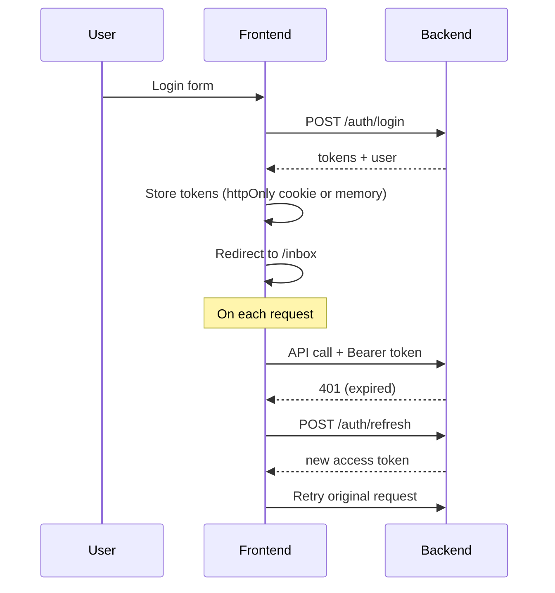

# 07 — Frontend Architecture

## Стек

| Библиотека | Назначение |
|------------|------------|
| Next.js 15 (App Router) | SSR, routing, layouts |
| React 19 | UI |
| TypeScript | Типизация |
| TanStack Query v5 | Server state, caching, mutations |
| Zustand | Client UI state |
| React Hook Form + Zod | Формы и валидация |
| shadcn/ui + Tailwind CSS | UI Kit |
| Lucide React | Иконки |
| next-themes | Light / Dark / System |

> Полная спецификация тем, токенов и семантических цветов — в [Design System](10-design-system.md).

## Структура проекта

```
apps/web/
├── public/
├── src/
│   ├── views/                        # Композиция экранов (InboxPage, AdminPage…)
│   │   ├── inbox/ui/InboxPage.tsx
│   │   └── ...
│   ├── app/                          # Next.js App Router — только роутинг
│   │   ├── (auth)/
│   │   │   ├── login/page.tsx        # re-export → views/login/ui/LoginPage
│   │   │   └── layout.tsx
│   │   ├── (dashboard)/
│   │   │   ├── layout.tsx
│   │   │   ├── inbox/page.tsx        # re-export → views/inbox/ui/InboxPage
│   │   │   ├── outbox/page.tsx
│   │   │   ├── requests/
│   │   │   │   ├── new/page.tsx
│   │   │   │   └── [id]/page.tsx
│   │   │   ├── admin/
│   │   │   │   ├── route-templates/page.tsx
│   │   │   │   ├── request-types/page.tsx
│   │   │   │   ├── users/page.tsx
│   │   │   │   └── org-units/page.tsx
│   │   │   └── notifications/page.tsx
│   │   ├── layout.tsx                # Root layout
│   │   └── providers.tsx             # QueryClient, Theme, Auth
│   │
│   ├── widgets/                      # Композитные UI-блоки
│   │   ├── request-card/
│   │   │   └── RequestCard.tsx
│   │   ├── route-timeline/
│   │   │   └── RouteTimeline.tsx
│   │   ├── inbox-table/
│   │   │   └── InboxTable.tsx
│   │   ├── sidebar/
│   │   │   └── Sidebar.tsx
│   │   └── header/
│   │       └── Header.tsx
│   │
│   ├── features/                     # Пользовательские действия
│   │   ├── auth/
│   │   │   ├── ui/LoginForm.tsx
│   │   │   └── model/useAuth.ts
│   │   ├── create-request/
│   │   │   ├── ui/CreateRequestForm.tsx
│   │   │   ├── ui/RoutePreview.tsx
│   │   │   ├── ui/DynamicFields.tsx
│   │   │   └── model/useCreateRequest.ts
│   │   ├── approve-request/
│   │   │   ├── ui/ApproveDialog.tsx
│   │   │   └── model/useApproveRequest.ts
│   │   ├── reject-request/
│   │   │   └── ui/RejectDialog.tsx
│   │   ├── request-actions/
│   │   │   └── ui/RequestActionBar.tsx
│   │   ├── add-comment/
│   │   │   └── ui/CommentForm.tsx
│   │   └── select-route/
│   │       └── ui/RouteSelector.tsx
│   │
│   ├── entities/                     # Бизнес-сущности
│   │   ├── request/
│   │   │   ├── model/types.ts
│   │   │   ├── api/requestApi.ts
│   │   │   └── ui/RequestStatusBadge.tsx
│   │   ├── user/
│   │   │   ├── model/types.ts
│   │   │   └── ui/UserAvatar.tsx
│   │   ├── route/
│   │   │   ├── model/types.ts
│   │   │   └── ui/StepStatusIcon.tsx
│   │   ├── request-type/
│   │   │   ├── model/types.ts
│   │   │   └── api/requestTypeApi.ts
│   │   └── notification/
│   │       ├── model/types.ts
│   │       └── api/notificationApi.ts
│   │
│   └── shared/                       # Переиспользуемое
│       ├── api/
│       │   ├── client.ts             # Axios/fetch instance
│       │   └── queryKeys.ts
│       ├── ui/                       # shadcn components
│       │   ├── button.tsx
│       │   ├── dialog.tsx
│       │   ├── table.tsx
│       │   └── ...
│       ├── lib/
│       │   ├── utils.ts
│       │   └── formatDate.ts
│       └── config/
│           └── routes.ts             # Route paths constants
│
├── next.config.ts
├── tailwind.config.ts
├── tsconfig.json
└── package.json
```

## Слои FSD — правила

```
┌─────────────────────────────────────────────┐
│  app          Роутинг Next.js (page.tsx)    │
├─────────────────────────────────────────────┤
│  views        InboxPage, AdminPage…         │
├─────────────────────────────────────────────┤
│  widgets      RequestCard, InboxTable       │
├─────────────────────────────────────────────┤
│  features     ApproveRequest, CreateRequest │
├─────────────────────────────────────────────┤
│  entities     request, user, route           │
├─────────────────────────────────────────────┤
│  shared       ui, api, lib, config           │
└─────────────────────────────────────────────┘

Импорт только вниз ↑
app → views → widgets → features → entities → shared
```

### App Router: почему `page.tsx`?

Next.js **требует** имя `page.tsx` — это точка входа маршрута, переименовать нельзя.  
Папку **`src/pages/` не используем** — Next.js путает её с Pages Router. Экраны живут в **`src/views/`**.

```typescript
// app/(dashboard)/inbox/page.tsx  ← только роутинг
export { InboxPage as default } from '@/views/inbox/ui/InboxPage';
```

## API Client

```typescript
// shared/api/client.ts
import axios from 'axios';

export const api = axios.create({
  baseURL: process.env.NEXT_PUBLIC_API_URL ?? '/api/v1',
});

api.interceptors.request.use((config) => {
  const token = getAccessToken();
  if (token) config.headers.Authorization = `Bearer ${token}`;
  return config;
});

api.interceptors.response.use(null, async (error) => {
  if (error.response?.status === 401) {
    await refreshToken();
    return api(error.config);
  }
  throw error;
});
```

## Query Keys

```typescript
// shared/api/queryKeys.ts
export const queryKeys = {
  requests: {
    all: ['requests'] as const,
    detail: (id: string) => ['requests', id] as const,
    inbox: (filters: InboxFilters) => ['requests', 'inbox', filters] as const,
    outbox: (filters: OutboxFilters) => ['requests', 'outbox', filters] as const,
  },
  requestTypes: {
    all: ['requestTypes'] as const,
    routes: (typeId: string) => ['requestTypes', typeId, 'routes'] as const,
  },
  notifications: {
    all: ['notifications'] as const,
  },
};
```

## Пример: Inbox

```typescript
// entities/request/api/requestApi.ts
export const requestApi = {
  getInbox: (filters: InboxFilters) =>
    api.get<PaginatedResponse<RequestListItem>>('/requests/inbox', { params: filters })
      .then(r => r.data),

  approve: (id: string, comment?: string) =>
    api.post<Request>(`/requests/${id}/approve`, { comment }).then(r => r.data),
};

// widgets/inbox-table/InboxTable.tsx
'use client';

export function InboxTable() {
  const [filters, setFilters] = useInboxFilters(); // Zustand
  const { data, isLoading } = useQuery({
    queryKey: queryKeys.requests.inbox(filters),
    queryFn: () => requestApi.getInbox(filters),
  });

  if (isLoading) return <TableSkeleton />;
  return <DataTable columns={inboxColumns} data={data?.data ?? []} ... />;
}
```

## Пример: Approve Mutation

```typescript
// features/approve-request/model/useApproveRequest.ts
export function useApproveRequest(requestId: string) {
  const queryClient = useQueryClient();

  return useMutation({
    mutationFn: (comment?: string) => requestApi.approve(requestId, comment),
    onSuccess: () => {
      queryClient.invalidateQueries({ queryKey: queryKeys.requests.detail(requestId) });
      queryClient.invalidateQueries({ queryKey: queryKeys.requests.inbox });
      toast.success('Запрос одобрен');
    },
    onError: (error) => {
      toast.error(getErrorMessage(error));
    },
  });
}
```

## UI State (Zustand)

```typescript
// features/inbox-filters/model/inboxFiltersStore.ts
interface InboxFiltersState {
  status: string | null;
  priority: string | null;
  page: number;
  setStatus: (status: string | null) => void;
  setPriority: (priority: string | null) => void;
  setPage: (page: number) => void;
  reset: () => void;
}

export const useInboxFilters = create<InboxFiltersState>((set) => ({
  status: 'active',
  priority: null,
  page: 1,
  setStatus: (status) => set({ status, page: 1 }),
  setPriority: (priority) => set({ priority, page: 1 }),
  setPage: (page) => set({ page }),
  reset: () => set({ status: 'active', priority: null, page: 1 }),
}));
```

## Ключевые экраны

### 1. Inbox (Входящие)

```
┌──────────────────────────────────────────────────┐
│ [Sidebar]  │  Входящие запросы                  │
│            │  ┌──────┬───────┬────────┬───────┐  │
│  Inbox     │  │Filter│Priority│ Search │       │  │
│  Outbox    │  └──────┴───────┴────────┴───────┘  │
│  New       │  ┌──────────────────────────────┐   │
│  Admin     │  │ Title    │ Author │ SLA │ ⋮  │   │
│            │  │ Отпуск.. │ Иванов │ 4h  │ →  │   │
│            │  │ Закупка..│ Петров │ ⚠   │ →  │   │
│            │  └──────────────────────────────┘   │
└──────────────────────────────────────────────────┘
```

### 2. Request Detail (Карточка запроса)

```
┌──────────────────────────────────────────────────┐
│ ← Назад   Отпуск 10–24 июля   [In Progress]      │
├──────────────────────┬───────────────────────────┤
│  Поля запроса        │  Маршрут (Timeline)       │
│  Дата начала: 10.07  │  ✓ Руководитель — Одобрен │
│  Дата конца:  24.07  │  ● HR — В работе (4ч)    │
│  Дней: 10            │  ○ Директор — Ожидает     │
│                      │                           │
│  Комментарии         │  [Одобрить] [Отклонить]   │
│  ┌────────────────┐  │  [Уточнить] [Эскалировать]│
│  │ Иванов: ...    │  │                           │
│  └────────────────┘  │                           │
│  [Добавить коммент.] │                           │
└──────────────────────┴───────────────────────────┘
```

### 3. Create Request (Создание)

```
Шаг 1: Выбор типа → Шаг 2: Заполнение полей → Шаг 3: Маршрут → Отправка

┌─────────────────────────────────────────┐
│  Создание запроса — Шаг 2/3             │
│                                         │
│  Тип: Отпуск                            │
│  ┌─────────────────────────────────┐    │
│  │ Дата начала  [10.07.2026     ]  │    │
│  │ Дата окончания [24.07.2026   ]  │    │
│  │ Кол-во дней  [10             ]  │    │
│  │ Причина      [               ]  │    │
│  └─────────────────────────────────┘    │
│                                         │
│  Маршрут:                               │
│  ○ Стандартный (руководитель → HR)      │
│  ○ Краткий (только руководитель)        │
│                                         │
│         [Назад]  [Далее →]              │
└─────────────────────────────────────────┘
```

## Компонент RouteTimeline

```typescript
// widgets/route-timeline/RouteTimeline.tsx
interface RouteTimelineProps {
  steps: RouteStep[];
  currentStepIndex: number;
}

export function RouteTimeline({ steps, currentStepIndex }: RouteTimelineProps) {
  return (
    <ol className="relative border-l border-gray-200">
      {steps.map((step, i) => (
        <li key={step.index} className="mb-6 ml-4">
          <StepStatusIcon status={step.status} />
          <div>
            <p className="font-medium">{step.name}</p>
            <p className="text-sm text-muted-foreground">
              {step.assigneeName}
              {step.status === 'active' && step.dueAt && (
                <SlaIndicator dueAt={step.dueAt} />
              )}
            </p>
            {step.completedAt && (
              <p className="text-xs text-muted-foreground">
                {step.resolution} — {formatDate(step.completedAt)}
              </p>
            )}
          </div>
        </li>
      ))}
    </ol>
  );
}
```

## Auth Flow



## Создание запроса — UI Flow

Экран `NewRequestPage` / `RequestDetailPage` (submit):

| Шаг | Компонент | Статус |
|-----|-----------|--------|
| 1. Тип + поля | `FieldSchemaForm` | ✅ Реализовано |
| 2. Маршрут (whitelist) | `RouteSelector` | 🔲 UC-05, не реализовано |
| 3. Персональный маршрут | `PersonalRouteBuilder` | 🔲 UC-06, не реализовано |
| 4. Превью + submit | `RouteFlowPreview` | 🔲 Частично |

### PersonalRouteBuilder (план)

```
features/build-personal-route/
├── ui/PersonalRouteBuilder.tsx   # список шагов + добавление согласующего
├── ui/ApproverPicker.tsx         # поиск сотрудника (user_ref / assignee)
└── model/usePersonalRoute.ts     # валидация, лимит шагов
```

Показывается если `requestType.allowsPersonalRoute === true`. По умолчанию предлагает `user.manager` из `/auth/me`.

### Admin: RequestTypeDesigner

Трёхшаговый wizard в `features/admin/ui/RequestTypeDesigner.tsx`:

1. **Основное** — code, name, description, isActive  
2. **Поля формы** — `FieldSchemaEditor` (compact): пресеты + таблица полей, live-превью справа  
3. **Маршрут** — default template, `allowedManualRoutes` (multi-select), `allowsPersonalRoute`, preview canvas  

Типы полей: `text`, `textarea`, `number`, `date`, `boolean`, `select`, `user_ref`.

## Route Protection

```typescript
// app/(dashboard)/layout.tsx
export default async function DashboardLayout({ children }) {
  const user = await getServerUser();
  if (!user) redirect('/login');
  return <DashboardShell user={user}>{children}</DashboardShell>;
}

// Admin routes
// app/(dashboard)/admin/layout.tsx
export default async function AdminLayout({ children }) {
  const user = await getServerUser();
  if (!user?.roles.includes('admin')) redirect('/inbox');
  return children;
}
```

## Realtime Updates

```typescript
// shared/api/useEventStream.ts
export function useEventStream() {
  const queryClient = useQueryClient();

  useEffect(() => {
    const source = new EventSource('/api/v1/events/stream');

    source.addEventListener('request_updated', (e) => {
      const { requestId } = JSON.parse(e.data);
      queryClient.invalidateQueries({ queryKey: queryKeys.requests.detail(requestId) });
      queryClient.invalidateQueries({ queryKey: queryKeys.requests.inbox });
    });

    source.addEventListener('notification', (e) => {
      queryClient.invalidateQueries({ queryKey: queryKeys.notifications.all });
    });

    return () => source.close();
  }, [queryClient]);
}
```

## Связанные документы

- [Design System](10-design-system.md)
- [Архитектура](03-architecture.md)
- [API](05-api-specification.md)
- [Роли и права](08-roles-and-permissions.md)
