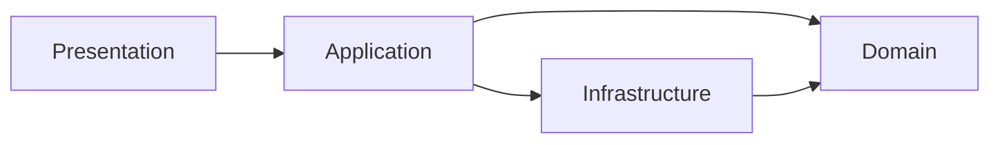

# 11 — Архитектурные правила

Жёсткие правила проекта. Цель — единый стиль, предсказуемая структура, защита от «нейрослопа» (случайного кода без слоёв, god-services, логики в UI).

Cursor-правила для AI лежат в `.cursor/rules/`.

---

## Какой подход у нас

**Да, Clean Architecture — но прагматичная (lite), не учебник.**

| Часть | Подход | Что это значит |
|-------|--------|----------------|
| **Backend** | Clean Architecture + DDD-lite + CQRS (упрощённый) | Слои, агрегаты, handlers; без event sourcing и без microservices |
| **Frontend** | Feature-Sliced Design (FSD) | Слои `app → widgets → features → entities → shared` |
| **Shared** | Общие типы и Zod-схемы | Один контракт для фронта и бэка |

### Что мы **не** делаем

- Полный Hexagonal с портами на каждую мелочь
- Event Sourcing
- Microservices / Kafka «на будущее»
- Отдельные read-модели (pure CQRS)
- Абстракции «на один раз» (interface с одной реализацией без причины)
- `utils/helpers/common` как свалка непонятного кода

### Формула

```
Backend:  Controller → Handler → Domain Entity → Repository (interface)
Frontend: Page → Widget → Feature hook → Entity API → shared
```

---

## Backend: слои и зависимости



| Слой | Путь | Можно | Нельзя |
|------|------|-------|--------|
| **Domain** | `modules/*/domain/` | Entities, VOs, domain errors, events, repository **interfaces** | NestJS, Prisma, HTTP, `@Injectable` на entity |
| **Application** | `modules/*/application/` | Handlers, orchestration, policies | SQL, PrismaClient, `@Res()`, `@Body()` |
| **Infrastructure** | `modules/*/infrastructure/` | Prisma repos, mappers, email, storage | Бизнес-правила, смена статусов |
| **Presentation** | `modules/*/presentation/` | Controllers, DTOs, guards | `request.approve()`, прямой Prisma |

### Правило зависимостей

```
✅ presentation → application → domain
✅ infrastructure → domain (implements interfaces)
❌ domain → infrastructure
❌ domain → presentation
❌ application → presentation
```

---

## Backend: naming & structure

### Один use case = один handler

```
✅ approve-request.handler.ts     → ApproveRequestHandler.execute()
❌ request.service.ts             → 800 строк: create, approve, reject, email...
```

### Controller — только HTTP-обёртка

```typescript
// ✅ GOOD — ≤ 15 строк на endpoint
@Post(':id/approve')
async approve(@Param('id') id: string, @Body() dto: ApproveDto, @CurrentUser() user: User) {
  await this.approveHandler.execute({ requestId: id, actorId: user.id, comment: dto.comment });
  return this.getRequestHandler.execute({ requestId: id, actorId: user.id });
}

// ❌ BAD — бизнес-логика в controller
@Post(':id/approve')
async approve(@Param('id') id: string) {
  const req = await this.prisma.request.findUnique({ where: { id } });
  if (req.status !== 'in_progress') throw new BadRequestException();
  req.status = 'approved';
  await this.prisma.request.update(...);
}
```

### Domain entity — поведение, не data bag

```typescript
// ✅ GOOD
request.approve(actorId, comment);

// ❌ BAD — anemic model + logic in handler
request.status = 'approved';
request.completedAt = new Date();
// + 50 строк if/else в handler
```

### Repository — только persistence

```typescript
// ✅ interface в domain/, impl в infrastructure/
interface RequestRepository {
  findById(id: RequestId): Promise<Request | null>;
  save(request: Request): Promise<void>;
}

// ❌ Prisma в handler
await this.prisma.request.update({ where: { id }, data: { status: 'approved' } });
```

### Side effects — через domain events

```typescript
// ✅ GOOD
request.approve(...);           // raises RequestApproved
await repo.save(request);
await eventBus.publishAll(request.pullEvents());

// ❌ BAD — в handler после approve
await this.emailService.send(...);
await this.notificationService.push(...);
await this.auditService.log(...);  // 3 прямых вызова в каждом handler
```

---

## Backend: модульные границы

Каждый bounded context — отдельный NestJS module:

| Module | Владеет |
|--------|---------|
| `request` | Request, Assignment, Transition, Comment |
| `routing` | RouteTemplate, RequestType, AssigneeResolver |
| `identity` | User, Role, OrgUnit, Auth |
| `notification` | Notification delivery |
| `audit` | AuditLog |

```
✅ request module → identity module (через application service, только UserId)
❌ request/domain → import { User } from '../../identity/domain'
❌ cross-module Prisma joins в domain logic
```

---

## Frontend: FSD правила

### Импорты только вниз

```
app → widgets → features → entities → shared
```

```typescript
// ✅ features/approve-request → entities/request
import { requestApi } from '@/entities/request';

// ❌ entities/request → features/approve-request
// ❌ shared → entities
// ❌ features/create-request → features/approve-request
```

### Где какая логика

| Что | Где |
|-----|-----|
| HTTP-вызовы | `entities/*/api/` |
| Mutation / Query | `features/*/model/` hooks |
| UI + user action | `features/*/ui/` |
| Композиция блоков | `widgets/` |
| Страница, layout | `app/` |
| Кнопки, input | `shared/ui/` |

```typescript
// ✅ GOOD
function ApproveDialog({ requestId }: Props) {
  const approve = useApproveRequest(requestId);
  return <Button onClick={() => approve.mutate()}>Одобрить</Button>;
}

// ❌ BAD — fetch прямо в компоненте
function ApproveDialog({ requestId }: Props) {
  const handleClick = async () => {
    await fetch(`/api/v1/requests/${requestId}/approve`, { method: 'POST' });
  };
}
```

### State

| Тип | Инструмент |
|-----|------------|
| Server data | TanStack Query |
| UI (filters, modals) | Zustand или useState |
| Forms | React Hook Form |

```
❌ Дублировать server data в Zustand
❌ useEffect + fetch вместо useQuery
❌ Context API для всего подряд
```

---

## Anti-patterns («нейрослоп»)

| # | Симптом | Как правильно |
|---|---------|---------------|
| 1 | `utils.ts` на 500 строк | Разложить по слоям или `shared/lib/` с конкретным именем |
| 2 | `RequestService` на 40 методов | Handlers: `CreateRequestHandler`, `ApproveRequestHandler` |
| 3 | Prisma model в controller | Mapper: Prisma → Domain → DTO |
| 4 | `any` / `@ts-ignore` | Типы из `packages/shared` |
| 5 | Бизнес-логика в React component | Hook в `features/*/model/` |
| 6 | Новая абстракция на 1 использование | Inline, пока не будет 2+ кейсов |
| 7 | Комментарий «TODO: refactor» без ticket | Сделать сейчас или завести issue |
| 8 | Копипаста handler'ов | Общая domain-логика в entity, не copy-paste |
| 9 | Случайные паттерны (Redux + Zustand + Context) | Только TanStack Query + Zustand |
| 10 | Файлы не по модулю (`src/services/all.ts`) | Структура из [03-architecture.md](03-architecture.md) |

---

## Новый код: чеклист перед PR

### Backend

- [ ] Handler в `application/commands/` или `queries/`
- [ ] Бизнес-логика в domain entity / domain service
- [ ] Controller ≤ 15 строк на endpoint
- [ ] Repository interface в domain, impl в infrastructure
- [ ] Side effects через events, не inline
- [ ] DTO отделён от domain entity
- [ ] Policy check для authorization
- [ ] Unit-тест domain без NestJS/Prisma

### Frontend

- [ ] API call в `entities/*/api/`
- [ ] Hook в `features/*/model/`
- [ ] Импорты не нарушают FSD
- [ ] Server state через TanStack Query
- [ ] Стили через design tokens, не hardcoded colors
- [ ] UI проверен в light и dark теме

---

## ESLint / CI (целевые guardrails)

При реализации добавить:

```json
// eslint import rules (conceptual)
"no-restricted-imports": [
  "error",
  {
    "patterns": [
      { "group": ["**/infrastructure/**"], "message": "Domain cannot import infrastructure" },
      { "group": ["@prisma/client"], "message": "Use repository, not Prisma directly" }
    ]
  }
]
```

```
apps/api/src/modules/*/domain/     → no @nestjs/*, no @prisma/*
apps/web/src/entities/             → no imports from features/widgets/app
apps/web/src/shared/               → no imports from entities
```

---

## Связанные документы

- [Архитектура](03-architecture.md)
- [Доменная модель](02-domain-model.md)
- [Фронтенд](07-frontend-architecture.md)
- [Design System](10-design-system.md)
- `.cursor/rules/` — правила для Cursor AI
